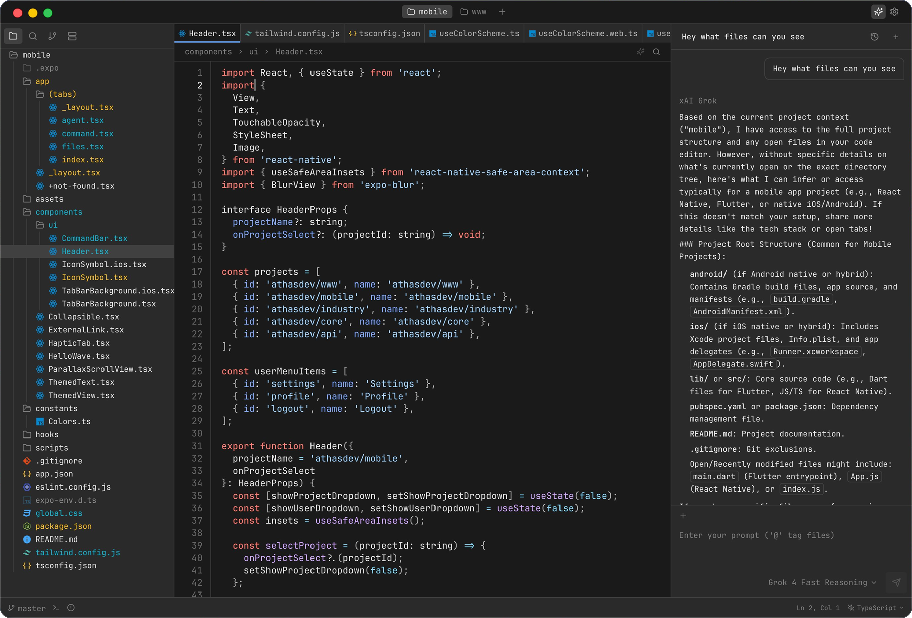

<div align="center">
  
  <h1>Relay</h1>
  <p>A lightweight browser-based code editor served by a Rust backend, with Git support, AI agents, and vim keybindings.</p>
  
</div>

Relay is a modified work derived from
[Athas](https://github.com/athasdev/athas). Original Athas portions are
Copyright (C) 2022-2025 Athas. Relay modifications are Copyright (C) 2026
jafupy and Relay contributors.

## Features

- AI agents
- Git integration
- Syntax highlighting
- LSP support
- Vim keybindings
- Integrated terminal
- SQLite viewer
- External editor support
- Enterprise policy controls (managed mode + extension allowlist)

## Download

Get the latest version from the [releases page](https://github.com/jafupy/relay/releases).

## Documentation

Install dependencies and start the local Relay server from the app package:

```bash
cd app
bun install
bun dev
```

## Contributing

Contributions are welcome! See the [contributing guide](CONTRIBUTING.md).
Please also review our
[Contributor License and Feedback Agreement](CONTRIBUTOR_LICENSE_AND_FEEDBACK_AGREEMENT.md).

## Support

- [Issues](https://github.com/jafupy/relay/issues)
- [Discussions](https://github.com/jafupy/relay/discussions)
- [Discord](https://discord.gg/DD8F38wFMv)

## Origin

Relay began as a hard fork of Athas and is now independently maintained.
The project keeps its Git history for attribution and provenance, but
development, issues, releases, and documentation now live under Relay.

## License

[AGPL-3.0-or-later](LICENSE). See [NOTICE.md](NOTICE.md) for attribution.
